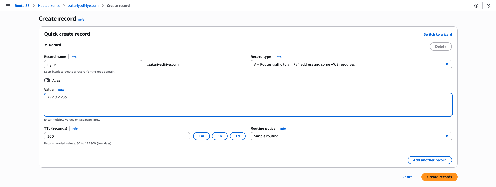
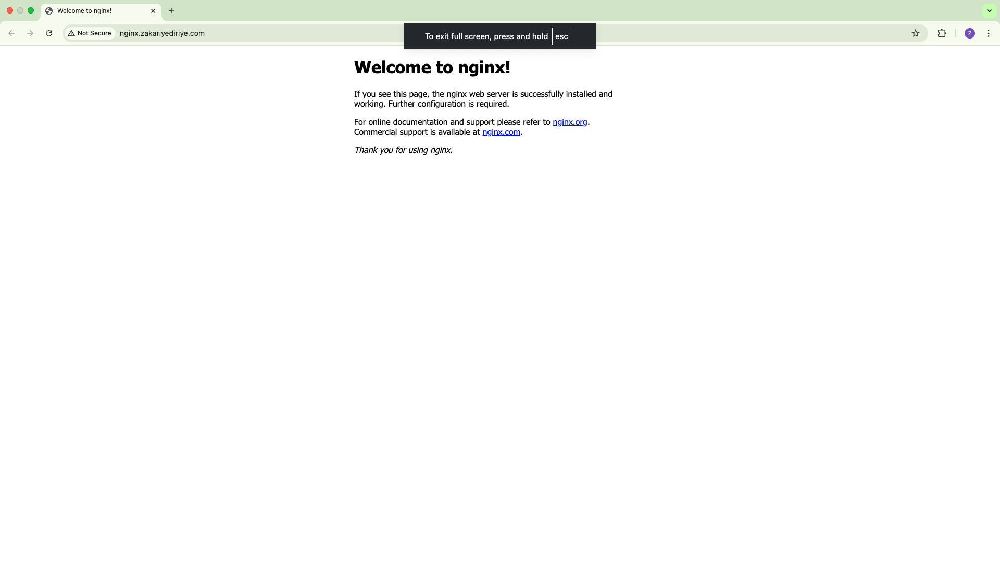

# Setting up NGINX on an EC2 instance and linking it to a domain

## 1. Registered a domain in Route 53

I registered the domain **zakariyediriye.com** using AWS Route 53. Once the registration was complete, Route 53 automatically created a hosted zone to manage the DNS records for the domain.

## 2. Created an EC2 instance

I created an **Ubuntu 24.04 EC2 instance** in AWS. I created a key pair to securely connect through SSH and also set up the security group to allow Port 22 so I can SSH into the EC2 instance and Port 80 so NGINX can show the default website.

## 3. Created a DNS A Record in Route 53

In the Route 53 hosted zone for zakariyediriye.com, I created an A record.

I entered the record name, made the record type **A** and in the value section entered the **Public IP address** of the EC2 instance. Then I pressed create record.



## 4. Connected to the EC2 using SSH

Before connecting, I ran the command:

```bash
chmod 400 nginx-key.pem
```

This made sure only I could read the key, which is required by SSH for security.

I then ran the command:

```bash
ssh -i nginx-key.pem ubuntu@EC2_Public_IP
```

to connect to the EC2 instance. `EC2_Public_IP` is the placeholder for where I actually put the public IP.

## 5. Installed and started NGINX

After connecting to the EC2 instance, I installed NGINX using apt by running the commands:

```bash
sudo apt update
sudo apt install nginx
```

I then ran:

```bash
sudo systemctl start nginx
```

to start NGINX. I then went to the domain [http://nginx.zakariyediriye.com/](http://nginx.zakariyediriye.com/) where the page successfully loaded, as shown below:


